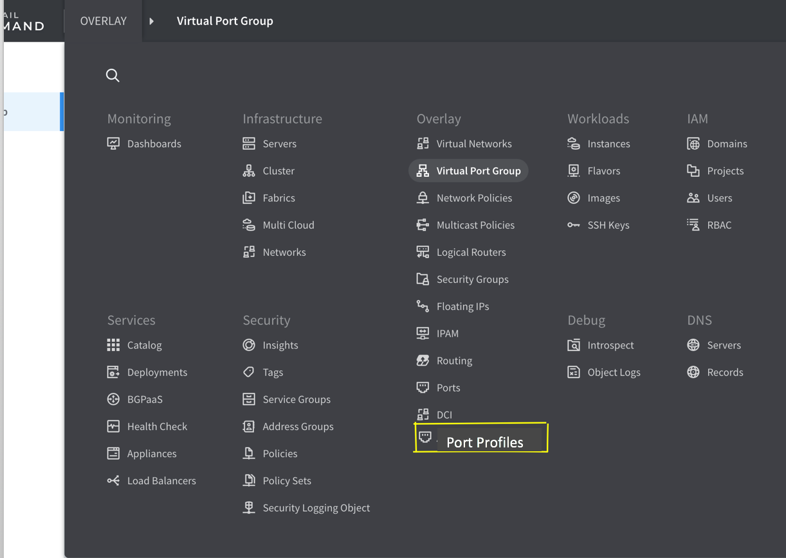
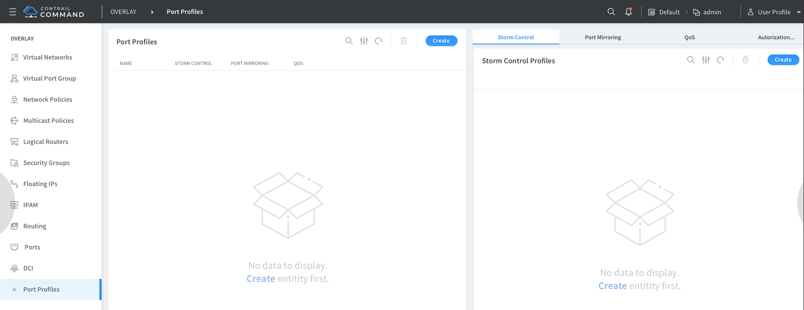
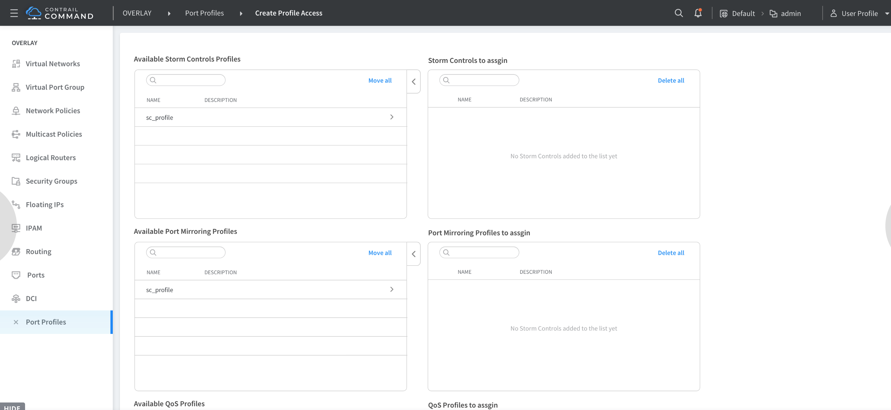
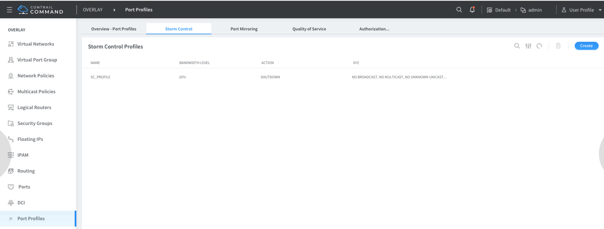
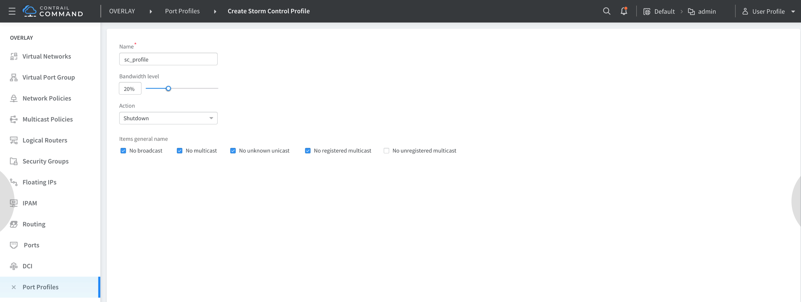
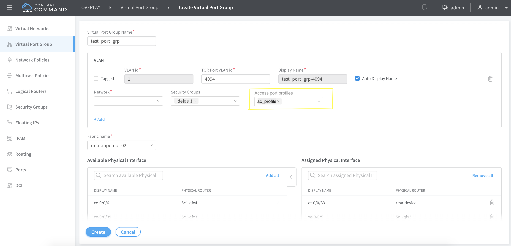

# 1. Introduction
A traffic storm occurs when broadcast packets prompt receiving devices to
broadcast packets in response. This prompts further responses, creating a
snowball effect. The switch is flooded with packets, which creates unnecessary
traffic that leads to poor performance or even a complete loss of service by
some clients. Storm control causes a device to monitor traffic levels and
take a specified action when a specified traffic level—called the storm
control level—is exceeded, thus preventing packets from proliferating
and degrading service. You can configure devices to drop broadcast and
unknown unicast packets, shut down interfaces, or temporarily disable
interfaces when the storm control level is exceeded.

# 2. Problem statement
Once devices are discovered on Contrail Command, user should be able to 
configure storm control on the interfaces.

# 3. Proposed solution
A new overlay configuration option called 'Port Profiles' will be added.
Port profile will currently compose of the storm control profile
configuration. Later on port profile can be leveraged as the docking
point for configurations like port mirroring etc

The port profile can be attached to a VPG. The options to create
port profiles, view existing ones will be provided.

The port profile will include a side panel to create the storm
control profile.

The storm control profile will contain the following configuration params - 
profile name, action, bandwidth (percentage), options to disable
storm control for unicast, multicast, unknown unicast, registered multicast and 
unregistered multicast. 

# 4. API schema changes

Objects to represent the port profile and the storm control are
added to the schema. The schema changes is captured below:

<xsd:simpleType name="StormControlActionType">
     <xsd:restriction base="xsd:string">
         <xsd:enumeration value="interface-shutdown"/>
     </xsd:restriction>
</xsd:simpleType>

<xsd:complexType name="StormControlActionListType">
    <xsd:all>
        <xsd:element name="storm-control-action" type="StormControlActionType" maxOccurs="unbounded"/>
    </xsd:all>
</xsd:complexType>

<xsd:element name="storm-control-profile" type="ifmap:IdentityType"
    description="Storm control profile definition"/>

<xsd:element name="project-storm-control-profile"/>
<!--#IFMAP-SEMANTICS-IDL
     Link('project-storm-control-profile',
          'project', 'storm-control-profile', ['has'], 'optional', 'CRUD',
          'list of storm control profiles supported.') -->
<xsd:element name="storm-control-bandwidth" type="xsd:integer"/>
<!--#IFMAP-SEMANTICS-IDL
         Property('storm-control-bandwidth', 'storm-control-profile', 'required', 'CRUD',
             'Configure storm control bandwidth level as percentage.') -->
<xsd:element name="no-broadcast" type="xsd:boolean" default='false'/>
<!--#IFMAP-SEMANTICS-IDL
         Property('no-broadcast', 'storm-control-profile', 'optional', 'CRUD',
             'if set to true, disable broadcast traffic storm control.') -->
<xsd:element name="no-multicast" type="xsd:boolean" default='false'/>
<!--#IFMAP-SEMANTICS-IDL
         Property('no-multicast', 'storm-control-profile', 'optional', 'CRUD',
             'if set to true, disable multicast traffic storm control.') -->
<xsd:element name="no-unknown-unicast" type="xsd:boolean" default='false'/>
<!--#IFMAP-SEMANTICS-IDL
         Property('no-unknown-unicast', 'storm-control-profile', 'optional', 'CRUD',
             'if set to true, disable unknown unicast traffic storm control.') -->
<xsd:element name="no-registered-multicast" type="xsd:boolean" default='false'/>
<!--#IFMAP-SEMANTICS-IDL
         Property('no-registered-multicast', 'storm-control-profile', 'optional', 'CRUD',
             'if set to true, disable registered multicast traffic storm control.') -->
<xsd:element name="no-unregistered-multicast" type="xsd:boolean" default='false'/>
<!--#IFMAP-SEMANTICS-IDL
         Property('no-unregistered-multicast', 'storm-control-profile', 'optional', 'CRUD',
             'if set to true, disable unregistered multicast traffic storm control.') -->
<xsd:element name="recovery-timeout" type="xsd:integer"/>
<!--#IFMAP-SEMANTICS-IDL
         Property('recovery-timeout', 'storm-control-profile', 'optional', 'CRUD',
             'Timeout in seconds. This enables the affected interface to recover automatically from the error condition after the specified period of time.') -->
<xsd:element name="storm-control-actions" type="StormControlActionListType"/>
<!--#IFMAP-SEMANTICS-IDL
         Property('storm-control-actions', 'storm-control-profile', 'optional', 'CRUD',
             'Default action (Discard) is implicit. In addition, other list of actions can be specified here.') -->

<xsd:element name="port-profile" type="ifmap:IdentityType"
    description="Encapsulates port configurations like storm control, QoS etc"/>

<xsd:element name="project-port-profile"/>
<!--#IFMAP-SEMANTICS-IDL
     Link('project-port-profile',
          'project', 'port-profile', ['has'], 'optional', 'CRUD',
          'Encapsulates port configurations like storm control etc') -->
<xsd:element name="port-profile-storm-control-profile"/>
<!--#IFMAP-SEMANTICS-IDL
     Link('port-profile-storm-control-profile', 'port-profile', 'storm-control-profile', ['ref'], 'optional', 'CRUD',
          'Storm control profile that this port profile uses.') -->
<xsd:element name="virtual-machine-interface-port-profile"/>
<!--#IFMAP-SEMANTICS-IDL
     Link('virtual-machine-interface-port-profile', 'virtual-machine-interface', 'port-profile', ['ref'], 'optional', 'CRUD',
          'Port profiles attached to this virtual machine interface') -->

# 5. Alternatives considered
Apart from the solution discussed above, the following options were considered:
Option1: Provide storm control profile configuration options in the node profile. 
The is not good approach since it will not allow reuse of the storm control 
profiles across the different node profiles.
Option2: Provide storm control profile configuration options during fabric creation.
This will not allow the reuse of the profiles across different fabrics.

# 6. UI changes / User workflow impact

#### - Select Port Profiles from the overlay features
User selects the 'Port Profiles' option from the list of overlay features

#### - Existing port profiles list
The existing Port Profile objects are displayed here. User can create
new port profiles from this page

#### - Existing storm control profiles list
Upon clicking to edit a port profile or creating a new one, the user is
taken into this page. The storm control tab here displays all the existing
storm control profile objects. The user can just select an (single) existing
storm control profiles or just create a new one via 'create' option on the
right hand top corner.

#### - Storm control creation page
User can create a new storm control profile by entering the bandwidth, action etc

#### - Port profile attachment to VPG
The port profile can be assigned to the VPG here. The port profiles
drop down will display the existing port profiles.

# 7. Notification impact
N/A

# 8. Provisioning changes
N/A

# 9. Implementation
The main implementation changes include:
1) Create new objects to represent the port profile and the storm control
profile in the schema. The port profile will refer to the virtual machine
interface (VMI) object.

2) Device manager changes to cache these new objects

3) Device manager changes to generate abstract config changes upon creation 
updation and deletion of the storm control objects

4) Jinja templates to generate the storm control configuration

The configurations for QFX10K and QFX5K vary slightly and the sample configs
are captured below:

####QFX10K
######Attaching profile:
set interfaces ae11 unit 0 family ethernet-switching storm-control stm-ctrl
set interfaces ae11 unit 0 family ethernet-switching recovery-timeout 600
######Configuring Profile:
set forwarding-options storm-control-profiles stm-ctrl all bandwidth-percentage 2
set forwarding-options storm-control-profiles stm-ctrl action-shutdown

####QFX5K:
######Attaching profile:
set interfaces ae11 unit 0 family ethernet-switching storm-control stm-ctrl

######Configuring Profile:
set forwarding-options storm-control-profiles stm-ctrl all bandwidth-percentage 2

# 10. Performance and scaling impact
N/A

# 11. Upgrade
N/A

# 12. Deprecations
N/A

# 13. Dependencies
N/A

# 14. Testing
#### Unit tests
#### Dev tests
#### System tests

# 15. Documentation Impact
The feature and workflow will have to be documented

# 16. References
JIRA story : https://contrail-jws.atlassian.net/browse/CEM-4179
Junos documentation: https://www.juniper.net/documentation/en_US/junos/topics/concept/rate-limiting-storm-control-qfx-series-understanding.html 
