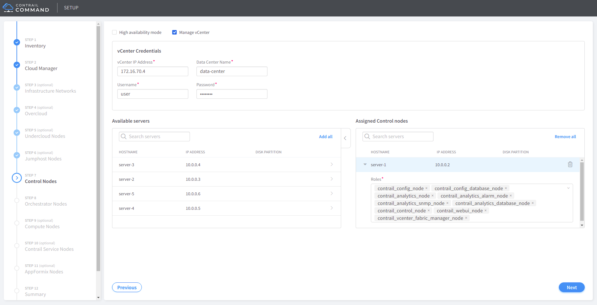
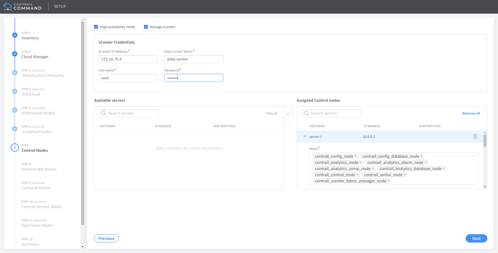
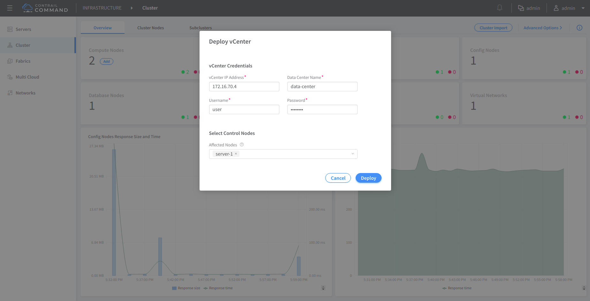
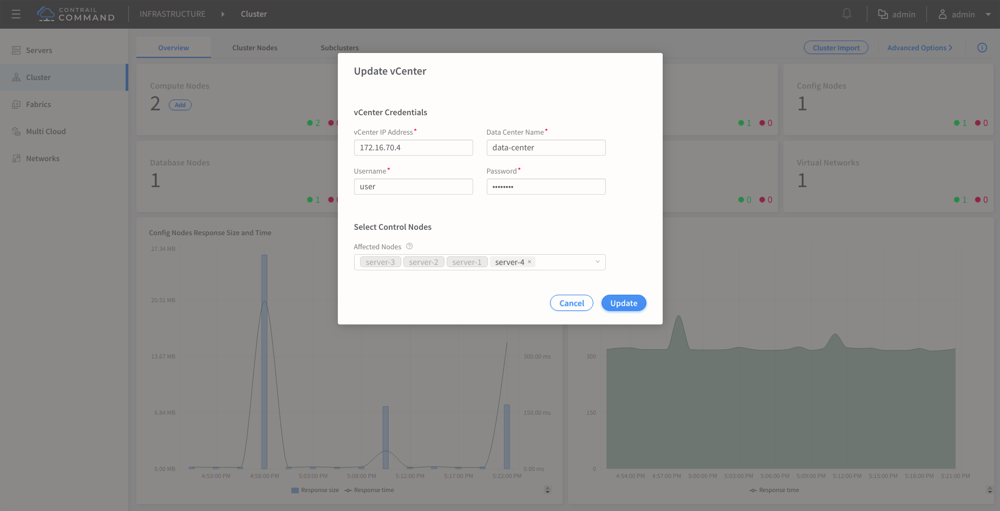
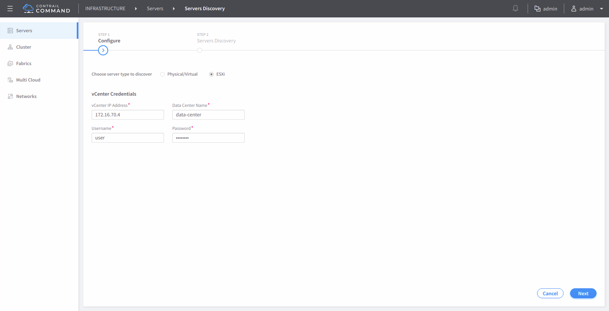
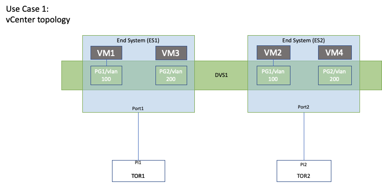
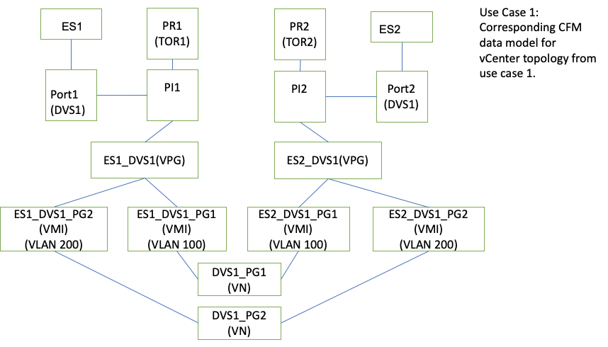

# 1. Introduction

This document describes the idea behind Contrail Fabric Manager and VMware integration to manage VMware underlay networks and contains an overview of the design of Contrail vCenter Fabric Manager (CVFM).

# 2. Problem statement

The purpose of this project is to synchronize the configuration of VMware Distributed Portgroups with the configuration on TOR (Leaf) switch (like QFX) port connected to the host (ESXi) where this Distributed Port Groups have active instance of VM’s. This will allow customers to configure the VLAN on Distributed Port Group of the Distributed Virtual Switch and have that VLAN configuration reflect on the switch port connected to the host.

# 3. Proposed solution

vSphere API can be used to obtain events regarding any Distributed Virtual Portgroup configuration change in vCenter. This information can be read using pyVmomi (Python API library for vSphere) and used to update the VNC database with appropriate data (using python VNC API library). Then, the desired configuration can be propagated to the QFXs by the Device Manager.

# 4. Alternatives considered

# 5. API schema changes

# 6. UI changes

The following screenshots capture the use visible changes

#### - CVFM deployment during cluster provisioning setup



#### - CVFM deployment during cluster provisioning setup (HA mode)



#### - CVFM deployment on brought up cluster



#### - CVFM update on brought up cluster



#### - Servers Discovery - ESXi hosts



# 7. Notification impact

# 8. Provisioning changes

Contrail vCenter Fabric Manager runs in separate docker container. That container is deployed using Contrail Ansible Deployer (CAD) through `vcenter_fabric_manager` role on contrail config node. Container requires access to config api and vCenter.

## Sample instances.yaml for Contrail vCenter Fabric Manager

```yaml
provider_config:
  bms:
    ssh_pwd:
    ssh_user: root
    ntpserver: tempus1.gum.gov.pl
    domainsuffix: local

instances:
  bms1:
    provider: bms
    ip: 10.100.0.93
    roles:
      config_database:
      config:
      control:
      analytics_database:
      analytics:
      webui:
      vcenter_fabric_manager:

global_configuration:
  CONTAINER_REGISTRY: opencontrailnightly
  CONTRAIL_VERSION: latest

contrail_configuration:
  CLOUD_ORCHESTRATOR: openstack
  CONTROLLER_NODES: 10.100.0.93
  KEYSTONE_AUTH_HOST: 10.100.0.93
  VCENTER_SERVER: 10.7.0.40
  VCENTER_USERNAME: administrator@vsphere.local
  VCENTER_PASSWORD:
  VCENTER_DATACENTER: cvfm-dc
  VCENTER_WSDL_PATH: /usr/src/contrail/contrail-web-core/webroot/js/vim.wsdl
  VCENTER_AUTH_PROTOCOL: https
  LOG_LEVEL: SYS_INFO
```

# 9. Implementation

Contrail vCenter Fabric Manager (CVFM) running on the config node of the contrail will perform the necessary tasks to achieve the automatic configuration and deletion of the VLANs on Switch Port based on the VLANs configured on the Distributed Port Groups of a Distributed Virtual Switch.

Contrail vCenter Fabric Manager (CVFM) will have the following behavior:

1. Plugin communicates with vCenter to listen to all the events related to vCenter like Port Group create/delete, VM create/delete, etc.
2. Plugin communicates with CFM to get the mapping between ESXi host and Switch Port (QFX).
3. Plugin communicates with CFM to configure the Switch Port with VLANs corresponding to Port Group VLANs configured on Distributed Virtual Switch.

## Limitations

- Not modifying the vSphere attributes if any required to handle the event/notifications from underlay.
- vCenter DVS will be independent for vCenter Fabric manager and Contrail vCenter Manager.
- Topology change requires CVFM plugin restart
- CVFM only supports Port Groups with a single VLAN ID (no support for VLAN trunking or private VLAN)

## Example Use Case Workflow

### Example vCenter topology and corresponding CFM data model




### Contrail Fabric Manager (CFM) workflow at high level

1. Professional service will run the scripts to capture the topology and run the Brownfield fabric onboarding workflow to onboard TOR switches and physical interfaces into the CFM database.
2. User creates JSON/YAML topology import file information to run the server topology import workflow in the UI. Sample JSON/YAML file looks as follows:

```yaml
nodes:
- name: node32
  node_type: esxi
  ports:
    - name: eth0
      mac_address: 0c:c4:7a:6c:d8:92
      switch_name: qfx1
      dvs_name: dvs_dummy
      port_name: xe-0/0/1
      switch_id: 3c:61:04:63:0e:80
    - name: eth1
      mac_address: 90:e2:ba:c1:cc:5d
      switch_name: 5b12-ex3
      dvs_name: dvs_dummy2
      switch_id: d0:07:ca:2b:f2:00
      port_name: xe-0/0/2
- name: node33
  node_type: esxi
  ports:
    - name: eth0
    mac_address: 0c:c4:7a:6c:d8:93
    switch_name: qfx2
    port_name: xe-0/0/3
    dvs_name: dvs_dummy
    switch_id: 3c:61:04:63:0e:81
    - name: eth1
    mac_address: 90:e2:ba:c1:cc:5a
    switch_name: 5b12-ex4
    switch_id: d0:07:ca:2b:f2:01
    port_name: xe-0/0/4
    dvs_name: dvs_dummy2
```

- Port object created by topology discovery/import module will capture the DVS info.
- Server import  module will populate the following object in the data model:
  - End system (ES1) - Port1 - PI1 - PR1
  - End system (ES2) - Port2 - PI2 - PR2

### Contrail vCenter Fabric Manager (CVFM) call flow at high level

1. When Port Group is created CVFM plugin will create a Fabric VN corresponding to it. VN name will be in this format: `<DVS name>_<PG name>`. When we receive the create event for PG1, we create the Fabric VN (`DVS1_PG1`). Similarly for when we receive the create event for `PG2`, we create the corresponding Fabric VN (`DVS1_PG2`).
2. When the first VM (`VM1`) is launched on `PG1` on End System (`ES1`),  CVFM plugin will walk the data model starting from End System (`ES1`)  up to PI (`PI1`) and will create the VMI which is unique per `<End system>_<DVS>_<PG>`  so in this case VMI will be `ES1_DVS1_PG1`.  
Before creating VMI we will check if VPG with name `ES1_DVS1` exists, if not we will create a new VPG with name `ES1_DVS1`, this VPG will have no references to any PI (physical interfaces) at this point. In this case the VPG will not exist so we will create it.
DVS information will be retrieved from Port Object’s field. VMI creation will be taking parameters PI (`PI1`), VN (`DVS1_PG1`) and VLAN (100 of `PG1`), and VPG (`ES1_DVS1`). VPG (`ES1_DVS1`) at this point will have `PI1` as physical interface.
3. When the second VM (`VM2`) is launched on `PG1` on End System (`ES2`),  CVFM plugin will walk the data model starting from End System (`ES2`)  up to PI (`PI2`) and will create the VMI which is unique per `<End system>_<DVS>_<PG>`  so in this case VMI will be `ES2_DVS1_PG1`.
Before creating VMI we will check if VPG with name `ES2_DVS1` exists, if not we will create a new VPG with name `ES2_DVS1`, this VPG will have no references to any PI (physical interfaces) at this point. In this case the VPG will not exist so we will create it.
DVS information will be retrieved from Port Object’s field. VMI creation will be taking parameters PI (`PI2`), VN (`DVS1_PG1`) and VLAN (100 of `PG1`), and VPG (`ES2_DVS1`). VPG (`ES2_DVS1`) at this point will have `PI2` as physical interface.
4. When the first VM (`VM3`) is launched on `PG2` on End System (`ES1`),  CVFM plugin will walk the data model starting from End System (`ES1`)  up to PI (`PI1`) and will create the VMI which is unique per `<End system>_<DVS>_<PG>`  so in this case VMI will be `ES1_DVS1_PG2`.
Before creating VMI we will check if VPG with name `ES1_DVS1` exists, if not we will create a new VPG with name `ES1_DVS1`, this VPG will have no references to any PI (physical interfaces) at this point. In this case VPG, ES1_DVS1 will exist, so we will use it.
DVS information will be retrieved from Port Object’s field. VMI creation will be taking parameters PI (`PI1`), VN (`DVS1_PG2`) and VLAN (200 of `PG2`), and VPG (`ES1_DVS1`).
5. When the second VM (`VM4`) is launched on `PG2` on End System (`ES2`), CVFM plugin will walk the data model starting from End System (`ES2`)  up to PI (`PI2`) and will create the VMI which is unique per `<End system>_<DVS>_<PG>` so in this case VMI will be `ES2_DVS1_PG2`.
Before creating VMI we will check if VPG with name `ES2_DVS1` exists, if not we will create a new VPG with name `ES2_DVS1`, this VPG will have no references to any PI (physical interfaces) at this point. In this case VPG, `ES2_DVS1` will exist, so we will use it.
DVS information will be retrieved from Port Object’s field. VMI creation will be taking parameters PI (`PI2`), VN (`DVS1_PG2`), VLAN (200 of `PG2`), and VPG (`ES2_DVS1`).
6. When the VM (`VM1`) is deleted on `ES1`, CVFM plugin will receive the VM delete event and determine that it’s the last VM on Port Group (`PG1`) on End System (`ES1`). Since it’s the last VM, we will get the VMI which was created and call VMI delete with VMI (`ES1_DVS1_PG1`), CVFM module should walk the data model and delete the VMI (`ES1_DVS1_PG1`). VPG will be deleted when the last VMI on the VPG is deleted.
7. When the VM (`VM2`) is deleted on `ES2`, CVFM plugin will receive the VM delete event and determine that it’s the last VM on Port Group (`PG1`) on End System (`ES2`). Since it’s the last VM, we will get the VMI which was created and call VMI delete with VMI (`ES2_DVS1_PG1`), CVFM module should walk the data model and delete the VMI (`ES2_DVS1_PG1`) and VN (`DVS1_PG1`).
8. When the VM (`VM3`) is deleted on `ES1`, CVFM plugin will receive the VM delete event and determine that it’s the last VM on Port Group (`PG2`) on End System (`ES1`). Since it’s the last VM, we will get the VMI which was created and call VMI delete with VMI (`ES1_DVS1_PG2`) , CVFM module should walk the data model and delete the VMI(ES1_DVS1_PG2).
9. When the VM (`VM4`) is deleted on `ES2`, CVFM plugin will receive the VM delete event and determine that it’s the last VM on Port Group (`PG2`) on End System (`ES2`). Since it’s the last VM, we will get the VMI which was created and call VMI delete with VMI (`ES2_DVS1_PG2`), CVFM module should walk the data model and delete the VMI (`ES2_DVS1_PG2`) and VN (`DVS1_PG2`).
10. When `PG1` is deleted, CVFM plugin will call CFM to delete the VN (`DVS1_PG1`). Since DPG are deleted only after all the VM’s are deleted we don’t have to maintain any reference for deleting VN’s.
11. When `PG2` is deleted, CVFM plugin will call CFM to delete the VN (`DVS1_PG2`). Since DPG are deleted only after all the VM’s are deleted we don’t have to maintain any reference for deleting VN’s

To perform those actions the application uses vCenter event mechanism. The application shall register for specific events and VM properties.

# 10. Performance and scaling impact

# 11. Upgrade

# 12. Deprecations

# 13. Dependencies

# 14. Testing

## Unit tests

The project repository will contain a suite of unit tests prepared by developers to verify that each code component works as expected on mocked data.

## Functional tests

The project repository will contain a suite of functional tests prepared by developers and meant to be run against a working instance of Config API node. These tests will use mocked data as vSphere Events and verify that a proper configuration is being pushed to VNC database.

# 15. Documentation Impact

# 16. References
